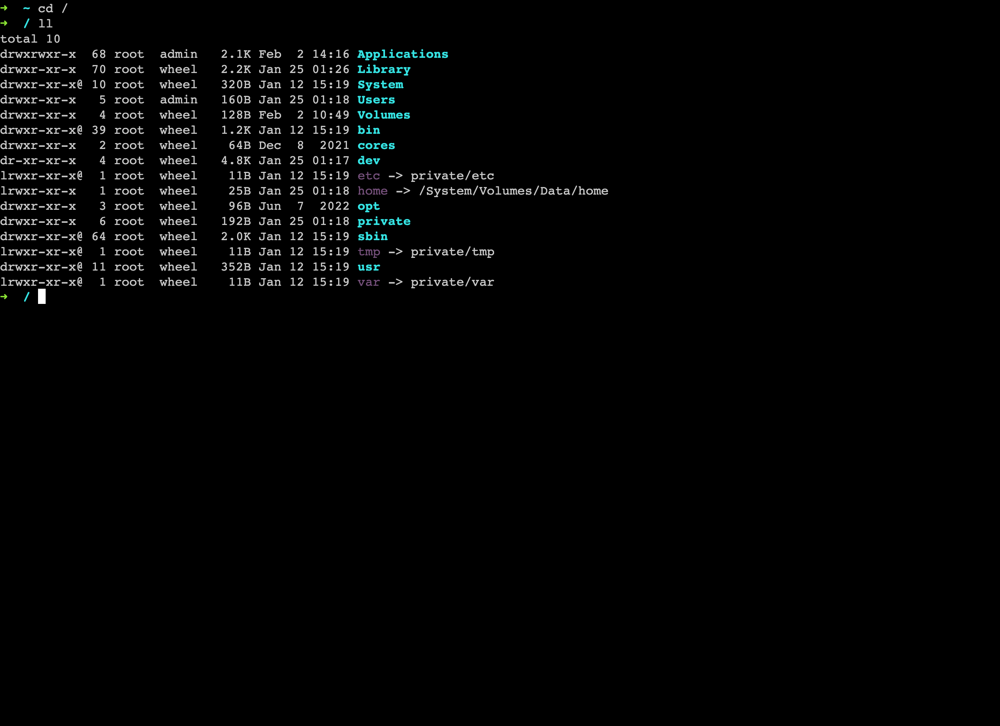

# ksoups

轻量级，中心化的多服务器运维平台。ksoups使用golang，vue 开发，支持Linux，MacOS。部署即可用。

feature: 文件管理，文件预览，快捷指令，命令编排，SSH。

ksoups由 center 和 probe 两部分组成。一个 center 对应多个 probe，负责向 probe 下发指令。 probe 主动连接并注册到 center ， 这意味着任何可以访问到 center 所在主机的服务器都可以被管理。

## 核心功能

#### 1.快捷指令

快捷指令可以是一行命令，或一个脚本。（脚本存储在probe工作目录的scripts文件夹中）。

你可以轻松创建，并执行指令内容。

#### 2.指令编排

指令编排，编排多个服务器的快捷指令，并进行指令调度。可用于集群应用部署，一键启动关闭集群。Docker容器批处理。

使用节点入度无限，出度为2的图结构，表示编排信息。指令从ROOT节点处开始执行，根据指令的执行状况，进入成功分支或失败分支。然后执行下一个节点。

#### 3.文件管理

轻量级文件管理，可管理与查看日志，配置文件，脚本文件。

#### 4.SSH

SSH功能由 center 支持，ui通过websocket与 center维持的SSH连接交互。

## 如何运作

center 负责暴露api，调度指令，存储指令信息。

probe 主动注册到中心节点，并开启断线重连机制，探针为无状态应用（需在配置中指定唯一名称），负责响应center的指令调用。

你需要确保探针到中心的网络连通。并且你的网络能访问中心节点。

我的使用情况：center 部署到云服务器，能连接互联网网的机器都能注册到center，并接受管理。

## 如何部署

##### center：  ./center -c path/to/center.yaml

##### probe：   ./probe -c path/to/probe.yaml

可自行编译，仓库内有编译脚本build.sh，可自行修改，编译。

如果你希望修改ui，可将 build 后产生的 dist 目录，放入apps/center/static内，然后执行build.sh

## API

完善中。。。。

## 长什么样

#### 登录

#### 首页

#### 文件管理

#### 快捷指令

#### 指令调度

#### SSH管理

#### SSH

